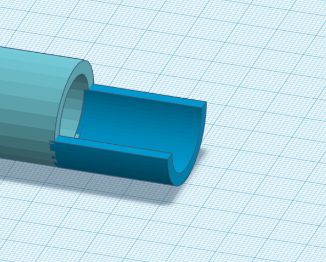

# Robot Motor System Documentation

## 1. **DC Motors (x4)**
We are using four high-torque gearmotors to drive the robot’s omnidirectional wheels, providing precise movement and control. These motors allow the robot to maneuver efficiently in any direction.

- **Model**: [High Torque Gearmotor Self-Locking Worm Gear Motor w/ Encoder - 24V, 145RPM](https://www.robotshop.com/products/e-s-motor-high-torque-gearmotor-self-locking-worm-gear-motor-w-encoder-24v-145rpm)
- **Voltage**: 24V
- **Rated Speed**: 85 RPM
- **Max Speed**: 145 RPM
- **Rated Torque**: 70 Kg.cm
- **Application**: These motors are responsible for controlling the omnidirectional movement of the robot, giving it the ability to smoothly navigate in all directions.

### why this model?   
- We caluclated how much torque we will need on each one of the motor wheels using the following equation:  
> ((weight of the robot)*(friction constant)*(wheels radius))/(number of wheels)  

weight of the robot: since in the rulebook says the maximum weight is 50Kg, so we used 50 kg as it is the maximu weight our robot can be like. 

friction constant: 0.01 average friction constant between wheels and concrete ground

wheels radius: assumed to e 4cm

number of wheels: 4

we got a resulte needed stall torque for each motor to be 42 kg.cm  
as it is better to use the motor with 30% out of their stall torques usage a 70 kg.cm motor is perfect for our application.

- Having a max speed of 145 RPM is also great for our robot.

---
---

## 2.Stepper Motor for projectile angle adjustment

- one stepper motor is used for Adjusting the angle at which a ball is shot by moving the last part of the cylidrical path that the ball goes through before it gets shot at the basket.

for better understanding. In the following image assuming that the light colored object is the cylindrical path that the ball will be moving in, the stepper motor would move a part like the darker colored object up and down adjusting the angle. 

## Why stepper Motor

stepper motor was chosen for this task due to its precision, simplicity of control, holding torque, and cost-effectiveness. It offers the exact positional control needed to adjust the angle at which the ball is shot, ensuring that the robotic system can deliver consistent and accurate performance.

---
- **Model**: [Hybrid Stepper Motor](https://www.robotshop.com/products/hybrid-stepper-motor-3d-printer)
- **Rated Voltage**: 3.4V
- **Current**: 1.7A
- **Holding Torque**: 3.5 Kg.cm

### why this model?  
> We chode this model for its high precison, low volateg and relatively low stall torque as it will not need to be moving any heavy objects

---
---

## 3. **Servo Motors (x2)**
Two servo motors are used for basketball handling functions, assisting in precise control of the fork mechanism.

- **Model**: [MG995 TowerPro Servo Motor (Half Metal Gear) - Continuous Rotation](https://makerselectronics.com/product/servo-motor-half-metal-gear-mg995-towerpro-continuous-rotation)
- **Operating Voltage**: 4.8V to 7.2V
- **Stall Torque**: 
  - 9.4 Kg.cm @ 4.8V
  - 11 Kg.cm @ 6V

#### Servo 1: Fork Control (Up/Down)
This servo controls the vertical movement of the fork. It raises or lowers the fork to dribble the basketball.

#### Servo 2: Fork Opening Mechanism
This servo operates the opening and closing of the fork. The fork opens to allow the basketball to be positioned above it, then closes to allow the ball to slide back into the robot, preparing it for passing or shooting.

## 4. Brushless Motors for Shooting the Ball (*2)

- Two brushless motors are used to drive two parallel cylinders that grip and launch a ball by spinning at high speeds. The ball is placed between the two rotating cylinders, and as the cylinders spin, they exert friction on the ball, accelerating it and launching it forward.

## Why Brushless Motors

 **Brushless motors** are used for this application because of their key advantages:

1. High RPM: Brushless motors can spin at very high speeds, which is crucial for generating the necessary velocity to launch the ball.

2. High Efficiency: These motors are more efficient and generate less heat compared to brushed motors, allowing for sustained high-speed operation.
 
3. No need for high torque as the motors will not be affected by any kind of force.

4. High durability: as brushless motors don't have brushes as the brushed motors which can get affected as time passes wich can cause some instabilities in the launcher.

---

- **Model**: [Brushless DC Motor, Built-in Driver, 24V, 6000rpm](https://www.robotshop.com/products/e-s-motor-36d-25l-brushless-dc-motor-built-in-driver-24v-6000rpm)
- **Voltage**: 24V
- **Rated Speed**: 5900 RPM
- **Max Speed**: 6000 RPM
- **Stall Torque**: 680 g.cm

### why this model?   

> This model was chosen speifcally for its high speed which will give us a big range in the robot's shooting power, its small weight, it was also chosen for its realively low price compared to its alternatives 

## 5. DC Motor for Ball Path Moving Belt

- In this application, a brushed DC motor was selected to drive a moving belt that carries a ball along the cylindrical path inside the robot that takes the ball from the forks and move it to the two brushless motors that shoot or pass the ball.

## Why DC Brushed Motor

1. Simple Speed Control: Brushed DC motors are simple to control using a direct DC power supply or a Pulse Width Modulation (PWM) signal.

2. Constant Speed: For the task of moving the ball along a cylindrical path, maintaining a relatively constant speed is important to ensure smooth shooting as the balls need to reach the shooter with the same speed each time. 

3. Low Cost: Brushed DC motors are generally more affordable than any other kind of motor

4. Sufficient Torque for Belt Movement: Brushed DC motors provide good starting torque even if the ball is stationary. The motor can easily overcome the initial inertia of both the belt and the ball.

---

- **Model**: [DC Motor With Gear Box](https://makerselectronics.com/product/dc-motor-with-gear-box-jga25-370-12v-400rpm-5-6kg-cm)
- **Voltage**: 12V
- **Rated Speed**: 400 RPM
- **Stall Torque**: 5.6 Kg.cm

### why this model?   

> This model was chosen for having enough stall torque to carry he basketball, its low cost and 400 rpm is more than enough for the moving belt. 

